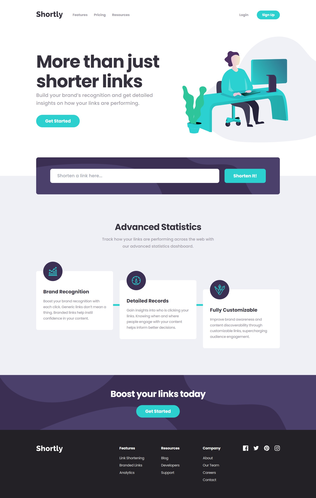

# Frontend Mentor - Shortly URL shortening API Challenge solution

This is a solution to the [Shortly URL shortening API Challenge challenge on Frontend Mentor](https://www.frontendmentor.io/challenges/url-shortening-api-landing-page-2ce3ob-G). Frontend Mentor challenges help you improve your coding skills by building realistic projects.

## Table of contents

- [Overview](#overview)
  - [The challenge](#the-challenge)
  - [Screenshot](#screenshot)
  - [Links](#links)
- [My process](#my-process)
  - [Built with](#built-with)
  - [Useful resources](#useful-resources)
- [Author](#author)

## Overview

### The challenge

Users should be able to:

- View the optimal layout for the site depending on their device's screen size
- Shorten any valid URL
- See a list of their shortened links, even after refreshing the browser
- Copy the shortened link to their clipboard in a single click
- Receive an error message when the `form` is submitted if:
  - The `input` field is empty

### Screenshot

### Links

- Solution URL: [https://www.frontendmentor.io/solutions/url-shortening-api-using-nextjs-Un0Zem55Yt](https://www.frontendmentor.io/solutions/url-shortening-api-using-nextjs-Un0Zem55Yt)
- Live Site URL: [https://next-url-shortening-api.vercel.app/](https://next-url-shortening-api.vercel.app/)

## My process

### Built with

- [React](https://reactjs.org/)
- [Typescript](https://www.typescriptlang.org/)
- [Next.js](https://nextjs.org/)
- [Tailwind CSS](https://tailwindcss.com/)
- [Clean URI API](https://cleanuri.com/)

### Useful resources

- [Clean URI Docs](https://cleanuri.com/docs) - Documentation for sending POST request to the cleanuri API.
- [Learn Accessibility Course](https://web.dev/learn/accessibility/) - Great resource for learning some best accessibility practices.
- [Accessible Components: The Hamburger Menu](https://www.linkedin.com/pulse/accessible-components-hamburger-menu-roc%C3%ADo-alvarado) - An article demonstrating the ways in which to handle hamburger style menu accessibility.
- [How to use a Button component as a link in React](https://whereisthemouse.com/how-to-use-button-as-link-in-react) - This article helped in making my reusable button component also function as an anchor component when needed.

## Author

- Website - [Antonio Mercado](https://amdev.work)
- Frontend Mentor - [@antmercado94](https://www.frontendmentor.io/profile/antmercado94)
- Twitter - [@FirstFoodShop](https://www.twitter.com/firstfoodshop)
